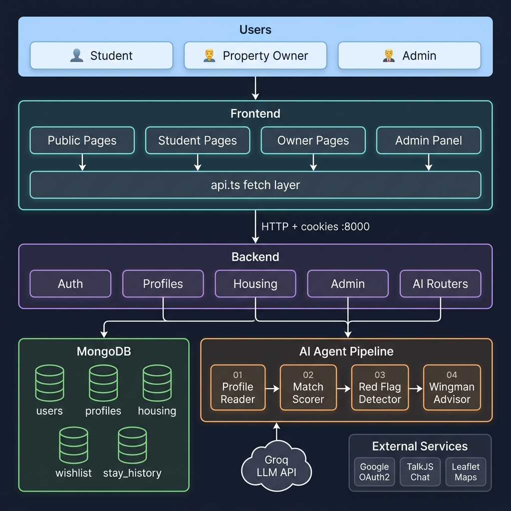
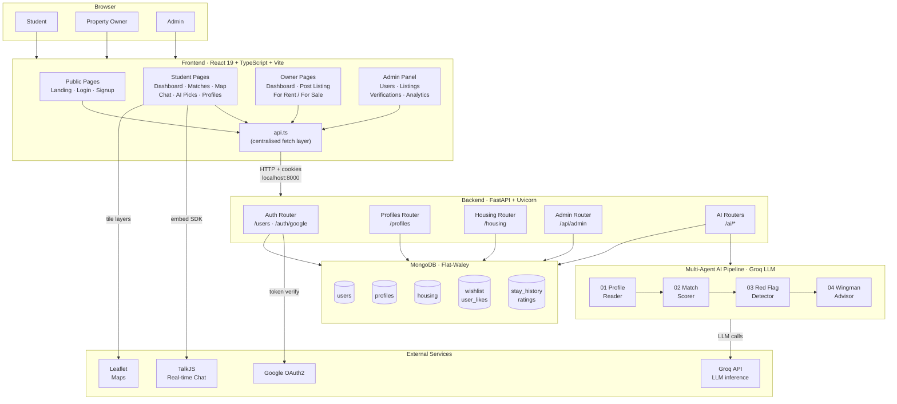

[](https://fastapi.tiangolo.com/)
[](https://react.dev/)
[](https://www.typescriptlang.org/)
[](https://www.mongodb.com/)
[](https://groq.com/)

# RoomEase — AI-Powered Roommate & Housing Finder

> **Final Year Project** | Smarter, Safer, Stress-Free Student Living

RoomEase is a full-stack web application that transforms how Pakistani university students find compatible roommates and housing. It leverages a **multi-agent AI pipeline** powered by Groq LLMs to intelligently match students based on lifestyle, habits, and budget — while proactively detecting potential red flags before they become real problems.

---

## Project Structure

```
RoomEase/
├── frontend/          # React + TypeScript + Vite web application
├── backend/           # FastAPI + MongoDB + Multi-Agent AI backend
├── Codes/             # Scratch/reference code and screenshots
└── README.md          # This file
```

---

## System Architecture



> The diagram below is an interactive Mermaid version of the same architecture (renders on GitHub):



---

## Key Features

### For Students (Room Seekers)
| Feature | Description |
|---|---|
| **AI Roommate Matching** | Multi-agent pipeline scores compatibility across lifestyle, schedule, budget & more |
| **Red Flag Detection** | AI proactively identifies potential conflicts before you commit |
| **Wingman Advisor** | Human-readable explanations for why a match is (or isn't) recommended |
| **AI Housing Picks** | Personalized housing recommendations based on your profile |
| **Interactive Map** | Browse listings on a Leaflet-powered map |
| **Real-time Chat** | TalkJS-powered messaging with potential roommates |
| **Profile Verification** | Upload documents for admin-verified badge |
| **Wishlist & History** | Save favourite listings; track past stays & ratings |

### For Property Owners
| Feature | Description |
|---|---|
| **Post & Manage Listings** | Create, edit, and delete for-rent / for-sale listings |
| **Tenant Chat** | Built-in messaging inbox with interested tenants |
| **Listing Dashboard** | Overview of all active listings with view/edit/delete controls |

### For Admins
| Feature | Description |
|---|---|
| **User Management** | View and remove users from the platform |
| **Listing Moderation** | Review and delete reported/inappropriate listings |
| **Verification Queue** | Approve or reject user identity verification requests |
| **Analytics Dashboard** | Platform-wide usage stats and metrics |

---

## Multi-Agent AI Pipeline

The heart of RoomEase is a **4-agent orchestration pipeline** that runs in parallel for fast, explainable results:

```
User Profile
     |
     v
+-----------------------------------------------------+
|                   MatchPipeline                     |
|                                                     |
|  +------------------+   +----------------------+   |
|  | 01 Profile Reader |-->| 02 Match Scorer Agent|   |
|  |  (parse_profile) |   |  (LLM compatibility) |   |
|  +------------------+   +----------+-----------+   |
|                                    |                |
|                         +----------v-----------+   |
|                         | 03 Red Flag Detector  |   |
|                         | (conflict detection)  |   |
|                         +----------+-----------+   |
|                                    |                |
|                         +----------v-----------+   |
|                         |  04 Wingman Advisor   |   |
|                         | (explain + negotiate) |   |
|                         +----------------------+   |
+-----------------------------------------------------+
     |
     v
  Top-N Ranked Matches (with scores, explanations, red flags)
```

| Agent | File | Role |
|---|---|---|
| Profile Reader | `profile_reader_agent.py` | Extracts structured attributes from free-text bios |
| Match Scorer | `match_scorer_agent.py` | Scores lifestyle/habit compatibility (0-100) |
| Red Flag Detector | `red_flag_agent.py` | Flags HIGH/MEDIUM/LOW conflicts & safety concerns |
| Wingman Advisor | `wingman_agent.py` | Generates plain-English summaries & negotiation tips |

Pipeline features: **parallel execution** (ThreadPoolExecutor, 6 workers), **in-memory caching** (5-min TTL), and city-level **pre-filtering** to keep latency low.

---

## Tech Stack

### Frontend
| Technology | Version | Purpose |
|---|---|---|
| React | 19 | UI framework |
| TypeScript | ~5.9 | Type-safe development |
| Vite | 7 | Build tool & dev server |
| React Router DOM | 7 | Client-side routing |
| Framer Motion | 12 | Animations & transitions |
| Leaflet / React-Leaflet | 1.9 / 5 | Interactive maps |
| TalkJS | 0.46 | Real-time chat |
| Bootstrap 5 + Bootstrap Icons | 5.3 | UI components & icons |
| Lucide React | 0.559 | Additional icon set |
| AOS | 2.3 | Scroll animations |
| Google OAuth (`@react-oauth/google`) | 0.13 | Social login |

### Backend
| Technology | Purpose |
|---|---|
| FastAPI | REST API framework |
| MongoDB (PyMongo + Motor) | Primary database (async + sync) |
| GridFS | File/image storage |
| Groq API | LLM inference for all 4 agents |
| Python-JOSE + PassLib (bcrypt) | JWT authentication & password hashing |
| Google Auth | OAuth2 social login |
| Uvicorn | ASGI server |

---

## Getting Started

### Prerequisites
- **Node.js** >= 18 and **npm**
- **Python** >= 3.10
- A running **MongoDB** instance (local or Atlas)
- A **Groq API key** (free tier available at [console.groq.com](https://console.groq.com))

---

### Backend Setup

```bash
cd backend

# 1. Create and activate a virtual environment
python -m venv venv
venv\Scripts\activate          # Windows
# source venv/bin/activate      # macOS/Linux

# 2. Install dependencies
pip install -r requirements.txt

# 3. Configure environment variables
# Copy the example below into backend/app/.env
```

**`backend/app/.env`** (required keys):
```env
MONGO_URI=mongodb://localhost:27017
DB_NAME=Flat-Waley
SECRET_KEY=your_jwt_secret_key_here
GROQ_API_KEY=your_groq_api_key_here
GOOGLE_CLIENT_ID=your_google_oauth_client_id
```

```bash
# 4. Run the development server
cd app
uvicorn main:app --reload --port 8000
```

API docs available at: **[http://localhost:8000/docs](http://localhost:8000/docs)**

---

### Frontend Setup

```bash
cd frontend

# 1. Install dependencies
npm install

# 2. Configure environment variables
# Create frontend/.env with:
```

**`frontend/.env`** (required keys):
```env
VITE_GOOGLE_CLIENT_ID=your_google_oauth_client_id
VITE_TALKJS_APP_ID=your_talkjs_app_id
```

```bash
# 3. Start the dev server
npm run dev
```

Frontend runs at: **[http://localhost:5173](http://localhost:5173)**

---

## Application Routes

### Public
| Route | Page |
|---|---|
| `/` | Landing Page |
| `/login-selection` | Choose login type |
| `/user-login` / `/user-signup` | Student authentication |
| `/property-owner-login` / `/property-owner-signup` | Owner authentication |
| `/admin-login` | Admin login |

### Student (Protected)
| Route | Page |
|---|---|
| `/dashboard` | Main dashboard |
| `/matches` | AI roommate matches |
| `/ai-picks` | AI housing recommendations |
| `/profiles` / `/profile/:id` | Browse & view profiles |
| `/messages` | Chat inbox |
| `/map` | Map view of listings |
| `/listing-details/:id` | Single listing detail |
| `/create-profile` / `/edit-profile` | Profile management |
| `/verification` | Identity verification |
| `/red-flag-alert` | AI safety warnings |
| `/wishlist` | Saved listings |
| `/history` | Past stays |
| `/notifications` | Notification centre |
| `/analytics-report` | Personal analytics |

### Property Owner (Protected)
| Route | Page |
|---|---|
| `/property-owner-dashboard` | Owner overview |
| `/property-owner-post-listing` | Create new listing |
| `/property-owner-for-sale` / `/property-owner-for-rent` | My listings by type |
| `/property-owner-detail-listing/:id` | Listing detail view |
| `/property-owner-messages` | Tenant chat inbox |
| `/property-owner-setting` | Account settings |

### Admin (Protected)
| Route | Page |
|---|---|
| `/admin-dashboard` | User management |
| `/listing-manage` | Listing moderation |
| `/verification-manage` | Verification queue |
| `/admin-analytics` | Platform analytics |

---

## API Overview

The backend exposes the following route groups (all prefixed from `http://localhost:8000`):

| Router | Prefix | Description |
|---|---|---|
| Users | `/users` | Registration, login, profile linking, likes, history, ratings |
| Profiles | `/profiles` | CRUD for user profiles |
| AI Match | `/ai/best_matches` | Multi-agent roommate matching |
| AI Housing | `/ai/recommended_housing` | Personalized housing picks |
| AI Profile Parse | `/ai/parse_profile` | Bio-text -> structured profile attributes |
| AI Red Flags | `/ai/red-flag-alerts` | Safety conflict detection |
| AI Wingman | `/ai/wingman` | Match explanation & negotiation tips |
| Housing | `/housing` | Property listing CRUD |
| Auth (Google) | `/auth/google` | Google OAuth2 sign-in |
| Verification | `/api/admin/verifications` | Admin verification queue |
| Admin | `/api/admin` | Users, listings, analytics |
| Static Files | `/uploads` | Uploaded images served statically |

---

## Database Collections (MongoDB — `Flat-Waley`)

| Collection | Purpose |
|---|---|
| `users` | Registered user accounts |
| `profiles` | Student lifestyle profiles |
| `housing` | Property listings |
| `wishlist` | User-saved listings |
| `user_likes` | Profile like/match tracking |
| `stay_history` | Past roommate/housing history |
| `ratings` | User ratings and reviews |

---

## User Roles

```
+-------------+     +------------------+     +-----------+
|   Student   |     |  Property Owner  |     |   Admin   |
|  (Seeker)   |     |   (Lister)       |     |           |
+-------------+     +------------------+     +-----------+
| Find rooms  |     | Post listings    |     | Moderate  |
| Find mates  |     | Manage listings  |     | Verify    |
| AI matching |     | Chat w/ tenants  |     | Analytics |
| Chat / Map  |     |                  |     |           |
+-------------+     +------------------+     +-----------+
```

---

## Utility Scripts (backend/app/)

| Script | Purpose |
|---|---|
| `uploadHouses.py` | Bulk-seed housing listings into MongoDB |
| `uploadPRofiles.py` | Bulk-seed user profiles into MongoDB |
| `seed_data.py` | Lightweight seed data helper |
| `make_admin.py` | Promote a user to admin role |
| `check_*.py` | Various DB health-check utilities |

---

## Roadmap / Known TODOs

- [ ] Email-based password reset (backend integration pending)
- [ ] Property Owner forgot-password page
- [ ] Push notifications
- [ ] Mobile-responsive optimisations
- [ ] Admin signup flow (currently placeholder)

---

## License

This project was developed as a Final Year Project. All rights reserved by the authors.
